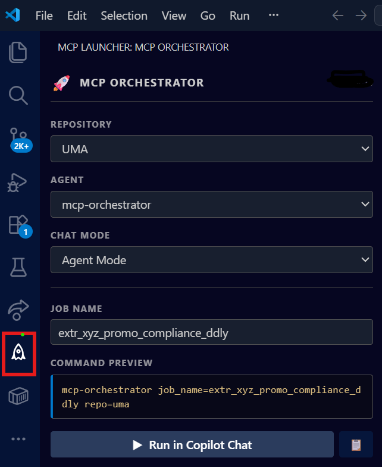
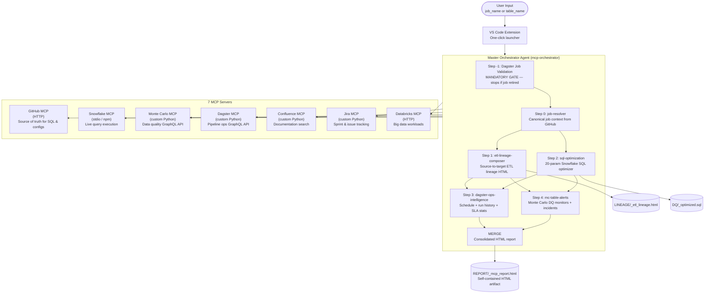

# Enterprise MCP Agent Orchestrator


> **A production-grade multi-agent AI orchestration system built with GitHub Copilot Agent Mode and the Model Context Protocol (MCP).**
> One command gives you a complete intelligence report for any ETL pipeline — source lineage, optimized SQL, live pipeline health, and data quality alerts — merged into a single self-contained HTML report.

---

## Screenshots

### VS Code Extension — One-Click Orchestrator UI
The project ships with a custom VS Code sidebar extension. Select your repository and job, then click **Run in Copilot Chat** to trigger the full agent pipeline without typing a single command.



---

## Why MCP (Model Context Protocol)?

Traditional AI assistants are limited to text. MCP changes that — it lets an AI agent call **live tools** (APIs, databases, file systems) as part of its reasoning loop, the same way a developer would.

This project uses MCP to give GitHub Copilot real-time access to 7 enterprise systems simultaneously:

```
GitHub Copilot Agent  ──MCP──▶  GitHub   (read SQL files, job configs)
                      ──MCP──▶  Snowflake (query warehouse, explain plans)
                      ──MCP──▶  Dagster   (pipeline schedules, run history)
                      ──MCP──▶  Monte Carlo (data quality monitors, incidents)
                      ──MCP──▶  Confluence (documentation search)
                      ──MCP──▶  Jira      (sprint and issue tracking)
                      ──MCP──▶  Databricks (big data workload analysis)
```

The AI doesn't just chat about your pipelines — it **calls them directly** and produces structured, verifiable artifacts.

---

## Architecture



---

## What This Project Demonstrates

| Agentic AI Concept | Implementation |
|---|---|
| **Agentic reasoning loop** | Master orchestrator gates, sequences, and merges 6 skill agents |
| **Tool use / function calling** | 40+ MCP tool calls across 7 live enterprise APIs |
| **Multi-agent decomposition** | Each skill is a standalone agent with typed input/output contracts |
| **Context passing between agents** | `job-resolver` produces a context object consumed by all downstream skills |
| **Prompt / spec engineering** | `SKILL.md` files define each agent's behavior, tools, and step-by-step logic |
| **Custom MCP server development** | 4 Python MCP servers built from scratch (Monte Carlo, Dagster, Confluence, Jira) |
| **Guardrails & safety** | Validation gates prevent hallucinated job names or stale artifact reads |
| **Artifact generation** | Self-contained HTML reports, optimized SQL files, interactive lineage visualizations |
| **Enterprise scale** | 60+ ETL jobs, 3 repositories, batch processing with user-confirmation gates |

---

## Components

### Agents (`.github/agents/`)

| Agent | Description |
|---|---|
| `mcp-orchestrator` | Master orchestrator. Accepts `job_name` or `table_name`, sequences all 6 skills, merges outputs into one HTML report. |
| `Agent1` (BatchOptimizer) | Batch processing agent. Processes all job folders in the repo in batches of 10 — SQL optimization then HTML report generation. |

### Skills (`.github/skills/`)

| Skill | Purpose | Key Tools Used |
|---|---|---|
| `job-resolver` | Resolves a job name/table name to a canonical context (GitHub path, SQL files, target tables). No local clone needed. | GitHub MCP |
| `etl-lineage-composer` | Parses job JSON configs to build a full source-to-target ETL task DAG. Generates interactive HTML lineage visualization. | GitHub MCP |
| `sql-optimization` | Applies 20 Snowflake-specific optimization rules to SQL files fetched from GitHub. Writes optimized files with a 9-section analysis header. | GitHub MCP |
| `dagster-ops-intelligence` | Fetches schedule config, last 20 run histories, avg/min/max runtimes, success/failure rates, and upstream/downstream dependencies from Dagster Cloud. | Dagster MCP (GraphQL) |
| `mc-table-alerts` | Surfaces all active DQ monitors, open incidents, table health scores, and SLA status for every target table in the job. | Monte Carlo MCP (GraphQL) |
| `html-report` | Standalone batch report generator. Reads optimized SQL summaries and produces styled self-contained HTML per job. | File system |
| `dagster-job-lineage` | Traverses Dagster's software-defined asset graph to produce a full upstream/downstream lineage HTML document for any Dagster job. | Dagster MCP |

### MCP Servers (`.vscode/mcp.json`)

| Server | Type | Purpose |
|---|---|---|
| **GitHub** | HTTP (official) | Read job configs, SQL files directly from GitHub — no local clone of source repos |
| **Snowflake** | stdio / npm | Query execution, schema introspection, explain plans |
| **Monte Carlo** | stdio / custom Python | Data quality monitoring via GraphQL API |
| **Dagster** | stdio / custom Python | Pipeline orchestration ops via Dagster Cloud GraphQL |
| **Confluence** | stdio / custom Python | Documentation search and page retrieval |
| **Jira** | stdio / custom Python | Sprint board and issue tracking |
| **Databricks** | stdio / custom Python | Big data workload analysis |

---

## Repository Structure

```
enterprise-mcp-agent-orchestrator/
├── .github/
│   ├── agents/
│   │   ├── mcp-orchestrator.md      # Master orchestrator agent definition
│   │   └── agent.md                 # Batch optimizer agent definition
│   └── skills/
│       ├── job-resolver/SKILL.md
│       ├── sql-optimization/SKILL.md
│       ├── etl-lineage-composer/SKILL.md
│       ├── dagster-ops-intelligence/SKILL.md
│       ├── mc-table-alerts/SKILL.md
│       ├── html-report/SKILL.md
│       └── dagster-job-lineage/SKILL.md
├── .vscode/
│   └── mcp.json                     # MCP server configuration (all credentials via VS Code prompts)
├── enterprise-orchestrator-ui/      # Web UI + REST API for browser-based job submission
│   ├── backend/                     # FastAPI + async job queue (Python)
│   ├── frontend/                    # React web UI
│   └── infra/                       # Docker + deployment configs
├── setup/
│   ├── README.md                    # Team onboarding guide
│   ├── install.ps1                  # One-command setup script (Windows)
│   └── mcp_servers/                 # Custom Python MCP server scripts
└── AGENTS.md                        # Agent architecture reference
```

---

## Output Artifacts

For each job processed, the orchestrator writes three local artifacts:

| Artifact | Path | Description |
|---|---|---|
| **MCP Intelligence Report** | `<OUTPUT>/<job>/REPORT/<job>_mcp_report.html` | Consolidated self-contained HTML: lineage, SQL analysis, Dagster ops, DQ alerts |
| **ETL Lineage Visualization** | `<OUTPUT>/<job>/LINEAGE/<job>_etl_lineage.html` | Interactive source-to-target task DAG with node classification |
| **Optimized SQL** | `<OUTPUT>/<job>/DQ/<file>_optimized.sql` | Annotated SQL with 9-section optimization analysis header |

---

## Getting Started

### Prerequisites

| Requirement | Version |
|---|---|
| Windows 10/11 | — |
| Python | 3.10+ |
| Node.js + npm | 18+ |
| VS Code | 1.90+ |
| GitHub Copilot extension | Latest (Agent Mode required) |

### Setup (5 minutes)

```powershell
# 1. Clone this repo
git clone https://github.com/singhsushil-nexgenai/enterprise-mcp-agent-orchestrator.git
cd enterprise-mcp-agent-orchestrator

# 2. Run the install script (installs Python deps, npm packages, copies MCP server scripts)
Set-ExecutionPolicy -Scope Process Bypass
.\setup\install.ps1

# 3. Place your corporate SSL certificate
Copy-Item path\to\your\cert.pem "$env:USERPROFILE\corporate_root_ca.pem"

# 4. Open in VS Code
code .
```

Then fill in the `<YOUR-...>` placeholders in `.vscode/mcp.json` and open GitHub Copilot Chat (`Ctrl+Alt+I`) → switch to **Agent Mode** → select **mcp-orchestrator** from the agent dropdown.

### Usage

Trigger by job name (most common):
```
job_name=your_pipeline_name repo=cmpgn
```

Trigger by target table name (the orchestrator auto-resolves the job):
```
table_name=YOUR_DATABASE.YOUR_SCHEMA.YOUR_TABLE
```

Run a subset of skills only:
```
job_name=your_pipeline_name repo=uma skills=[resolver,dagster,montecarlo]
```

Or use the **VS Code Extension** (see screenshot above) — select repo and job name from dropdowns, click **Run in Copilot Chat**.

VS Code will prompt for each credential the first time. No tokens are ever stored in files.

---

## Tech Stack

`GitHub Copilot Agent Mode` · `Model Context Protocol (MCP)` · `Python 3.14` · `Snowflake` · `Dagster Cloud` · `Monte Carlo` · `Atlassian Confluence` · `Jira` · `Databricks` · `FastAPI` · `React` · `Docker` · `GraphQL` · `PowerShell`

---

## Author

**Sushil Kumar Singh** — Data Engineer & Agentic AI Builder

[](https://www.linkedin.com/in/sushilkumarsingh-nexgenai)
[](https://github.com/singhsushil-nexgenai)

> Built as a production system at enterprise scale. Demonstrates end-to-end agentic AI design: custom MCP server development, multi-agent orchestration, prompt engineering as software engineering, and real-time enterprise API integration — all using GitHub Copilot's Agent Mode and the Model Context Protocol.
